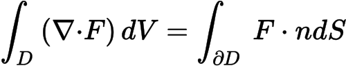

MathML to Image Service
=======================

HTTP Rest API for converting MathML to various image formats.

Converting MathML::

    <math xmlns="http://www.w3.org/1998/Math/MathML"><mrow><msup><mi>e</mi><mrow><mi>i</mi><mi>x</mi></mrow></msup><mo>=</mo><mi>cos</mi><mi>x</mi><mo>+</mo><mi>i</mi><mi>sin</mi><mi>x</mi></mrow></math>

Into images:

Contents
--------

.. toctree::
   :maxdepth: 2

   getting_started

Contribute
----------

- Issue Tracker: https://github.com/rudigiesler/mathml-to-image-service/issues
- Source Code: https://github.com/rudigiesler/mathml-to-image-service

Support
-------

If you are having issues, please log them on Github.

License
-------

The project is licensed under the MIT license.
